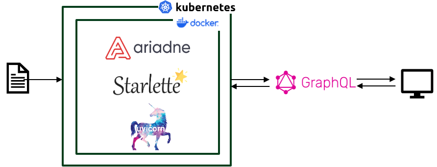

# GraphQL for Ensembl Variation

Hypsipyle is a GraphQL API developed to provide variant visualisations on Ensembl beta website which utilises VCF files produced by Ensembl Variant Effect Predictor (VEP) and enables querying and faster access of data

This application is implemented with [Ariadne](https://ariadnegraphql.org/), a schema-first graphql framework for Python.

GraphQL requires a schema (in `./common`) and implementation of resolver functions that know how to interpret specific parts of a GraphQL query. Resolvers are found in `./graphql_service/resolver`.

## Data model 
More details about the schema are available here: https://github.com/Ensembl/ensembl-vdm-docs 

## Implementation details
The API resolvers use VEP annotated VCF data to provide visualisations

The API can be queried against a single endpoint specifying the payload to be returned





## Running the API using Docker

The deployment assumes that we have a directory mounted with the convention `<data_root>/<genome_uuid>/variation.vcf.gz`. This VEP annotated VCF file generated using a Nextflow VEP pipeline.

The code currently fetches a single vcf file within the genome_uuid folder. In the future, we plan to fetch data from multiple VCFs for a single genome_uuid.

A template file `./example_connections.conf` is available. Copy this file and rename to `./connections.conf` and add path to the datafile.

The file follows the following template:
```
data_root = /app/data
```

### Running a container for development

Build the image using `./Dockerfile.dev`:

`docker build -t $NAME:$VERSION -f ./Dockerfile.dev .`

Run a container with the image (`--publish` below is exposing the container's ports to the host network):

`docker container run --publish 0.0.0.0:80:80/tcp --publish 0.0.0.0:8000:8000/tcp -ti -v <ensembl-hysipile-dir>:/app $NAME:$VERSION`


### Running a container for production
Build the image using `./Dockerfile.prod`:

`docker build -t $NAME:$VERSION -f ./Dockerfile.prod .`

Run a container with the image (`--publish` below is exposing the container's ports to the host network):

`docker container run --publish 0.0.0.0:80:80/tcp --publish 0.0.0.0:8000:8000/tcp -ti $NAME:$VERSION`

The connection configuration is assumed to exist in the repo as the file `./connections.conf` and gets built into the Docker 
image. 

### Querying the API
Once the container starts running, the GraphQL server will be running at the endpoint [0.0.0.0:8000](0.0.0.0:8000)
A simple query would look like:
```
query variant_example {
    variant(
    by_id: {genome_id: "a7335667-93e7-11ec-a39d-005056b38ce3", variant_id: "1:10153:rs1639547929"}
    ) {
    
        name
        primary_source {
        description
        url
        }
    }
}
```
More example queries can be found in `examples/`